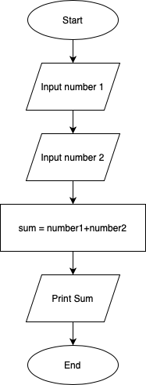
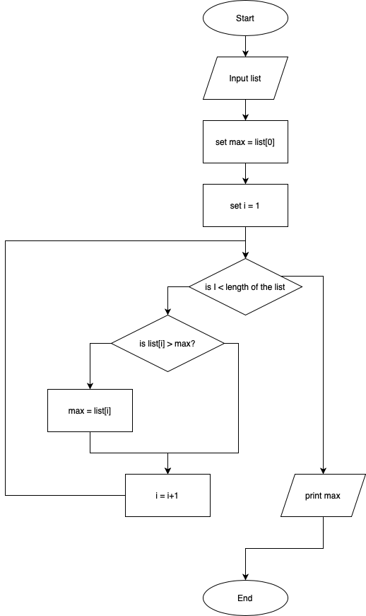

# Flowchart
- Diagram that represents a process or an algorithm.
- Has various boxes with different meaning connected to define a logic.

## Importance of Flowchart:
- To visualise the flow of the program for easier understanding and deugging.

## Flowchart Symbols
- Oval: Start/End
- Rectangle: Process/Step
- Diamond: Decision Point
- Parallelogram: Input/Output
- Arrow: Flow 

## Tools
- draw.io
- lucidchart
- Visial Paradigm
- Pen and paper

## Examples:

- Example 1: Calculate the sum of 2 numbers

- Example 2: Create a flowchart for finding the maximum number in a list
